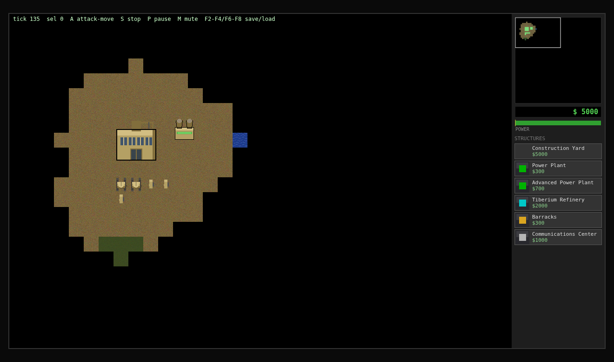

# Command & Conquer: Tiberian Dawn — Web Port

A from-scratch remake of the classic **Command & Conquer: Tiberian Dawn** (1995) by
Westwood Studios that runs directly in your browser. Game rules, stats, and damage
tables are transcribed from the [original GPL v3 source](https://github.com/electronicarts/CnC_Tiberian_Dawn)
released by Electronic Arts.



## ▶ How to play

No build step, no dependencies — you just need a browser and any static file server:

```bash
cd Testeipad
python3 -m http.server 8000
```

Then open **http://localhost:8000/game/** — main menu → SKIRMISH → pick your faction,
enemy AI difficulty, starting credits, and map seed → START GAME.

> ES modules can't load over `file://`, which is why the one-line server is needed.
> macOS ships `python3`, so the command above works out of the box on a Mac.

### Controls

| Input | Action |
|---|---|
| Left-click / drag | Select unit / box-select |
| Right-click | Move, or attack the enemy under the cursor |
| Right-drag | Pan the camera (arrows & screen edge also scroll) |
| A + click | Attack-move |
| Ctrl + click | Force-attack the ground |
| S / D / H | Stop / Deploy MCV / send harvester to work |
| R / X | Repair / sell the selected building |
| Ctrl+1–9, 1–9 | Assign / recall control groups |
| P / M | Pause / mute |
| F2–F4, F6–F8 | Save / load (3 slots, localStorage) |
| Sidebar | Click to build; click READY item to place it (ghost shows legality) |

## What's implemented

- Deterministic sim core at the original's 15 ticks/sec: same seed + same commands
  ⇒ identical game (save/load resumes bit-identically; tested)
- Original stats and combat math: UDATA/IDATA/BDATA unit tables, CONST.CPP weapon
  table, warhead-vs-armor percentages, `damage * modifier >> 8`
- A\* pathfinding (octile, no corner cutting, infantry pass through trees)
- Full economy: tiberium growth/spread, 28-bail harvester cycle, power grid with
  low-power penalties
- Base building: tech tree, pay-as-you-go build queues, placement rules, MCV deploy,
  sell/repair, defense towers
- Skirmish AI with faction build orders, attack waves, three difficulty tiers
- Fog of war (shroud + fog, per house), victory/defeat with match stats
- Synthesized WebAudio SFX (no copyrighted samples)

## Project layout

```
game/            ← the playable web game (plain ES modules, zero dependencies)
  src/sim/       ← deterministic, headless game logic (runs in node for tests)
  src/render/    ← canvas rendering (reads sim state, never writes it)
  test/          ← node --test game/test/*.test.js  (150+ tests)
assets/          ← generated placeholder sprites & sheets
original_source/ ← EA's GPL v3 C&C source (reference only; not compilable)
engine/          ← earlier C++/SDL2 port attempt (frozen, kept as reference)
tools/           ← asset generators (Pillow) and legacy build scripts
legacy/          ← retired demos (single-file HTML prototype, terminal demo)
docs/            ← REBOOT_PLAN.md (roadmap), PROGRESS.md (dev log), screenshots
```

## Development

```bash
node --test game/test/*.test.js   # the whole sim test suite
```

The sim (`game/src/sim/`) never touches the DOM, all mutation flows through
`commands.js` + `gameTick()`, and determinism is enforced by tests — see
`docs/REBOOT_PLAN.md` for the architecture and roadmap, and `docs/PROGRESS.md`
for the iteration-by-iteration development log.

## License

Game rule data derives from the C&C Tiberian Dawn source released under **GPL v3**;
this project follows the same license. Command & Conquer is a trademark of
Electronic Arts. This is a non-commercial fan remake; you should own the original
game (available in the C&C Ultimate Collection).
